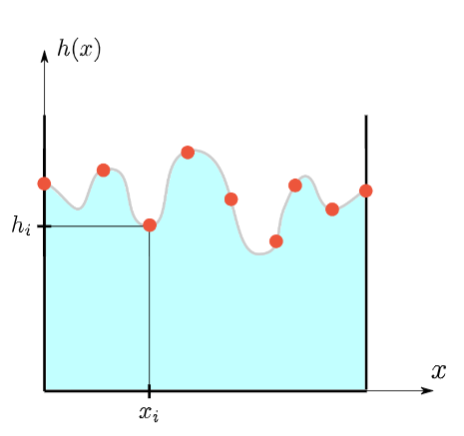

# Лабораторная работа № 1: Интерполяция в условиях измерений с неопределенностью

## Базовая часть:

  1. Разработать функцию `qubic_spline_coeff(x_nodes, y_nodes)`, которая посредством решения матричного уравнения вычисляет коэффициенты естественного кубического сплайна.
  2. Написать функции `qubic_spline(x, x_nodes, qs_coeff)` и `d_qubic_spline(x, x_nodes, qs_coeff)`, которые вычисляют соответственно значение кубического сплайна и его производной в точке `x` (`qs_coeff` обозначает матрицу коэффициентов).
  3. Используя данные в таблице 1, требуется построить аппроксимацию зависимости уровня поверхности жидкости h(x) от координаты x (рис. 1) с помощью кубического сплайна и продемонстрировать ее на графике вместе с исходными узлами.

Рисунок 1. Поверхность вязкой жидкости (серая кривая), движущейся сквозь некоторую среду (например, пористую). Её значения известнытолько в нескольких точках (красные узлы)

Таблица 1: Значения уровня поверхности вязкой жидкости

|  |  |  |  |  |  |  |  |  |  |  |  |
| --- | --- | --- | --- | --- | --- | --- | --- | --- | --- | --- | --- | 
| `x_i` | 0.0 | 0.1 | 0.2 | 0.3 | 0.4 | 0.5 | 0.6 | 0.7 | 0.8 | 0.9 | 1.0 |
| `h_i` | 3.37 | 3.95 | 3.73 | 3.59 | 3.15 | 3.15 | 3.05 | 3.86 | 3.60 | 3.70 | 3.02 |

## Продвинутая часть:

  1. Разработать функцию `l_i(i, x, x_nodes)`, которая возвращает значение i-го базисного полинома Лагранжа, заданного на узлах с абсциссами `x_nodes`, в точке `x`.
  2. Написать функцию `L(x, x_nodes, y_nodes)`, которая возвращает значение интерполяционного полинома Лагранжа, заданного на узлах с абсциссами `x_nodes` и ординатами `y_nodes`, в точке $x$.
  3.  Известно, что при измерении координаты `x` всегда возникает погрешность, которая моделируется случайной величиной с нормальным распределением с нулевым математическим ожиданием и стандартным отклонением $10^{-2}$. Требуется провести следующий анализ, позволяющий выявить влияние этой погрешности на интерполяцию. Сгенерировать 1000  векторов значений $[ \tilde x_1,..., \tilde x_{11}]^T$ предполагая, что $\tilde x_i = x_i + Z$, где $x_i$ соответствует значению в таблице 1 и $Z$ является случайной величиной с нормальным распределением с нулевым математическим ожиданием и стандартным отклонением $10^{-2}$. Для каждого из полученных векторов построить интерполянт Лагранжа, предполагая, что в качестве абсцисс узлов используются значения $\tilde x_i$, а ординат -- $h_i$ из таблицы 1. В результате вы должны иметь 1000 различных интерполянтов. Предполагая, что все интерполянты представляют собой равновероятные события, построить такие функции $\tilde h_l(x)$ и $\tilde h_u(x)$, где $\tilde h_l(x) < \tilde h_u(x) \ \forall x \in [0, 1]$, что вероятность того, что значение интерполянта в точке будет лежать в интервале $[\tilde h_l(x) , \  \tilde h_u(x)]$, равна 0.9. Отобразить на едином графике функции $h_l(x), \ h_u(x)$, усредненный интерполянт и узлы из таблицы 1. Какие участки интерполянта и почему являются наиболее чувствительными к погрешностям?
    
  4. Повторить анализ, описанный в предыдущем пункте, в предположении, что координаты $x_i$ вам известны точно, в то время как измерения уровня поверхности $h_i$ имеют ту же погрешность, что и в предыдущем пункте. Изменились ли выводы вашего анализа?
  5. Повторить два предыдущие пункта для случая интерполяции кубическим сплайном. Какие выводы вы можете сделать, сравнив результаты анализа для интерполяции Лагранжа и интерполяции кубическим сплайном?

## Результаты

Расположены в директории `hw1`: в файле `comp_math_lab1.ipynb` находится код с комментариями, в файле `educmm_lab_2021_rk6_52b_gorelkinaee_lab1.pdf` находится подробный отчет о проделланой работе.

Ключевые результаты: семейства интерполянтов и доверительные полосы приведены на рисунках ниже:

# Лабораторная работа № 3 : Модель биологического нейрона

## Вводная часть

Численные методы решения задачи Коши для систем обыкновенных дифференциальных уравнений (ОДУ) 1-го порядка активно используются далеко за пределами стандартных инженерных задач. Примером области, где подобные численные методы крайне востребованы, является нейробиология, где открытые в XX веке модели биологических нейронов выражаются через дифференциальные уравнения 1-го порядка. Математическая формализация моделей биологических нейронов также привела к появлению наиболее реалистичных архитектур нейронных сетей, известных как спайковые нейронные сети (Spiking Neural Networks). В данной лабораторной работе будет исследована одна из простейших моделей подобного типа: модель Ижикевича.

## Модель Ижикевича

Дана система из двух ОДУ 1-го порядка:

$$
\begin{cases}
      f_1(u, v) = \frac{dv}{dt} = 0.04v^2 + 5v + 140 - u + I, \\
      f_2(u, v) = \frac{du}{dt} = a(bv - u),
\end{cases} 
$$

и дополнительного условия, определяющего возникновение импульса в нейроне:

$$
v \ \geq \ 30 \Rightarrow
 \begin{cases}
   v \leftarrow c,
   \\ 
   u \leftarrow u+d,
 \end{cases}
$$

где $v$ -- потенциал мембраны (мВ), $u$ -- переменная восстановления мембраны (мВ), $t$ - время (мс), $I$ -- внешний ток, проходящий через синапс в нейрон от всех нейронов, с которыми он связан.

Данная система имеет параметры:

- a -- задает временной масштаб для восстановления мембраны (чем больше a, тем быстрее происходит восстановление после импульса);

- b  -- чувствительность переменной восстановления к флуктуациям разности потенциалов;

- c  -- значение потенциала мембраны сразу после импульса;

- d  -- значение переменной восстановления мембраны сразу после импульса.

Таблица 3: Характерные режимы заданной динамической системы и соответствующие значения ее параметров

| Режим | a | b | c | d |
| --- | --- | --- | --- | --- | 
| Tonic spiking(TS) | 0.02 | 0.2 | -65 | 6 |
| Phasic spiking(PS) | 0.02 | 0.25 | -65 | 6 |
| Chattering(C) | 0.02 | 0.2 | -50 | 2 |
| Fast spiking(FS) | 0.1 | 0.2 | -65 | 2 |

## Базовая часть

1. Реализовать следующие функции, каждая из которых возвращает дискретную траекторию системы ОДУ с правой частью, заданной функцией `f`, начальным условием `x_0`, шагом по времени `h` и конечным временем `t_n`:

-- `euler(x_0, t_n, f, h)`, где дискретная траектория строится с помощью метода Эйлера;

-- `implicit_euler(x_0, t_n, f, h)`, где дискретная траектория строится с помощью неявного метода Эйлера;

-- `runge_kutta(x_0, t_n, f, h)`, где дискретная траектория строится с помощью метода Рунге–Кутта 4-го порядка.

2. Для каждого из реализованных методов численно найти траектории заданной динамической системы, используя шаг $h = 0.5$ и характерные режимы, указанные в таблице 3. В качестве начальных условий можно использовать $v(0) = c$ и $u(0) = bv(0)$. Внешний ток принимается равным $I = 5$. 

3. Вывести полученные траектории на четырех отдельных графиках как зависимости потенциала мембраны $v$ от времени $t$, где каждый график должен соответствовать своему характерному режиму работы нейрона.

4. По полученным графикам кратко описать особенности указанных режимов. 

## Продвинутая часть

1. Объяснить, в чем состоят принципиальные отличия реализованных методов? В чем они схожи?

2. Произвести интегрирование во времени до 1000 мс нейронной сети с помощью метода Эйлера, используя следующую информацию.

а) Динамика каждого нейрона в нейронной сети описывается заданной моделью Ижикевича. В нейронной сети имеется 800 возбуждающих нейронов и 200 тормозных. Возбуждающие нейроны имеют следующие значения параметров: $a = 0.02$, $b = 0.2$, $c = -65+15\alpha$, $d = 8-6\beta^2$ и внешний ток в отсутствие токов от других нейронов равен $I = I_0 = 5\xi$, где $\alpha$, $\beta$ и $\xi$ – случайные числа от 0 до 1 (распределение равномерное). Тормозные нейроны имеют следующие значения параметров: $a = 0.02 + 0.08\gamma$, $b = 0.25 - 0.05\delta$, $c = -65$, $d = 2$ и внешний ток в отсутствие токов от других нейронов равен $I = I_0 = 2\zeta$, где $\gamma$, $\delta$ и $\zeta$ – случайные числа от 0 до 1. В качестве начальных условий используются значения $v(0) = -65$ и $u(0) = bv(0)$.

б) Нейронная сеть может быть смоделирована с помощью полного графа. Матрица смежности \textbf{\textit{W}} этого графа описывает значения токов, передаваемых от нейрона к нейрону в случае возникновения импульса. То есть, при возникновении импульса нейрона $j$ внешний ток связанного с ним нейрона $i$ единовременно увеличивается на величину $W_{ij}$ и затем сразу же падает до нуля, что и моделирует передачу импульса по нейронной сети. Значение $W_{ij}$ равно $0.5\theta$, если нейрон $j$ является возбуждающим, и $-\tau$, если тормозным, где $\theta$ и $\tau$ – случайные числа от 0 до 1.

3. Вывести на экран импульсы всех нейронов как функцию времени и определить частоты характерных синхронных (или частично синхронных) колебаний нейронов в сети.

## Результаты

